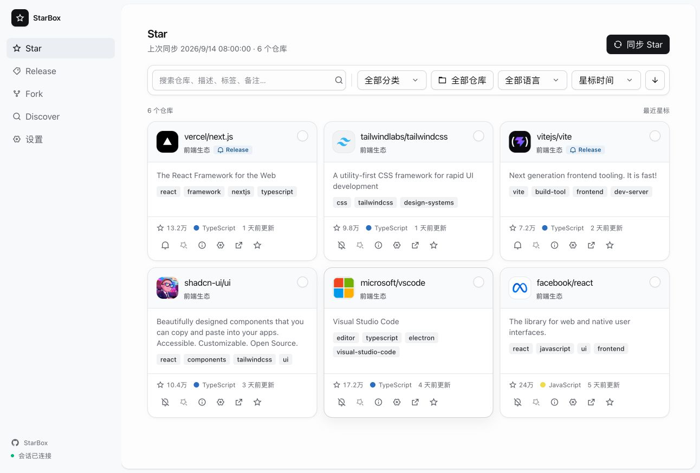

<div align="center">

# StarBox

**A self-hosted GitHub workspace for organizing Stars, Releases, Forks, and the projects worth discovering next.**

[](https://github.com/iPotatow/StarBox/actions/workflows/ci.yml)

English · [简体中文](README.md)

</div>

<p align="center">
  
</p>

StarBox is for developers who want a durable way to maintain their GitHub information stream. It brings starred repositories, releases, existing forks, and project discovery into one workspace, while account data lives in a self-hosted Cloudflare Worker + D1 deployment that can be used from multiple devices.

## What you get

| Page | What it helps with |
| --- | --- |
| **Star** | Search and organize starred repositories with category, language, and time filters; read READMEs, subscribe to releases, and use AI summaries, tags, categorization, and batch analysis. |
| **Release** | Aggregate releases from subscribed repositories into a timeline or repository view, with filters for version range, platform, and asset type. |
| **Fork** | Track existing forks against upstream, including ahead/behind status and the latest GitHub Actions run; sync upstream or run a workflow manually. |
| **Discover** | Search GitHub for popular, active, or recent repositories, filter by language, topic, and time range, then star them directly. |
| **Settings** | Connect GitHub and an optional AI service, and manage categories, appearance, navigation, release rules, and data import/export. |

StarBox intentionally does not provide Gist management or fork creation, keeping the workspace focused on maintaining and discovering repositories.

## Why self-host it

- D1 is the source of truth for account data; IndexedDB is a local acceleration cache, not a replacement for server state.
- The Worker encrypts GitHub tokens, AI API keys, and custom headers with AES-256-GCM before storing them in D1. Safe API responses and Bootstrap never return plaintext credentials.
- Login uses a secure cookie and rate-limits attempts. Mutating requests validate the same-origin `Origin` and JSON `Content-Type`.
- Star sync reads up to 3,000 repositories, persists D1 rows in batches of up to 50, and uses indexes for Bootstrap, release ordering, and retention cleanup.

## Quick start

### Local development

```bash
npm install
npm run check
npm run dev
```

`npm run check` runs type checking, tests, a production build, and deterministic UI verification for the five main routes. `npm run dev` starts a static UI preview; `/api/*` returns 501, so full API integration requires Wrangler, the local D1 schema/upgrade SQL, and local credentials.

### Deploy to Cloudflare

Install dependencies and authenticate with the Cloudflare account you intend to use:

```bash
npm install
npx wrangler login
npm run deploy
```

The deployment script runs `npm run check`, finds or creates a D1 database whose name exactly matches `starbox`, and then acts on the detected remote schema: an empty database executes only `migrations/0001_schema.sql`; supported retired schemas (both the pre-0014 multi-table shape and the consolidated single-user shape) upgrade through `migrations/0002_legacy_upgrade.sql`; an already-current database executes no SQL. The repository enforces exactly those two SQL files and no longer keeps an ever-growing migration history. The final eight-table schema is verified before the Worker and static assets are deployed with a temporary Wrangler config. The tracked `wrangler.jsonc` does not need a database UUID and is not rewritten by the script.

If Wrangler exposes multiple Cloudflare accounts, set `CLOUDFLARE_ACCOUNT_ID`. Production deployments also need login settings and encryption keys configured in the Cloudflare Dashboard or with `npx wrangler secret put <NAME>`:

| Variable | Purpose and default |
| --- | --- |
| `LOGIN_USERNAME` | Login username; defaults to `admin`. A custom value is recommended in production. |
| `LOGIN_PASSWORD` | Login password; a **non-empty value is required**. If it is missing, StarBox refuses login; there is no default-password fallback. |
| `SESSION_TTL_SECONDS` | Session lifetime; defaults to `604800` seconds (7 days). |
| `STARBOX_ENCRYPTION_KEY` | The only runtime encryption setting for GitHub tokens, AI keys, and sensitive custom headers. It must be non-empty; StarBox trims it, derives a key with SHA-256, and uses AES-256-GCM. |

Never put secrets in the repository or `wrangler.jsonc`. After deployment, attach a custom domain or Worker route before exposing the app publicly.

## Sync and performance

Normal mutations do not trigger an immediate full Bootstrap after server acknowledgement; Bootstrap remains the authoritative reconciliation path. The browser persists only changed IndexedDB entity stores and coalesces rapid writes. Star cards use `content-visibility` to defer offscreen layout and paint work in large collections.

The current D1 model stays at eight product tables; `processed_mutations`, `activity_log`, and `sync_changes` are not part of the active architecture. Repository user fields use `user_revision` for optimistic concurrency, while Release bodies/assets/AI summaries remain browser-owned cache data. SQL is capped at two files: `0001_schema.sql` is the final empty-database schema and `0002_legacy_upgrade.sql` contains compatibility stages for the supported retired multi-table and consolidated single-user shapes; deployment selects the stage from the detected remote schema. Unknown/intermediate schemas still fail closed instead of being guessed. Deployment verifies relationships, JSON integrity, preserved data counts, and key query plans. Workers Logs are enabled with 10% head sampling, and `workers_dev` remains `false`.

## Stack

React 19, TypeScript, `@base-ui/react`, Tailwind CSS 4, Cloudflare Workers, Static Assets, D1, and Wrangler. UI primitives use the [COSS](https://github.com/cosscom/coss) `apps/ui` copy/paste-and-own model (MIT); behavior primitives use [Base UI](https://github.com/mui/base-ui) (MIT), icons follow the COSS convention with [Lucide](https://github.com/lucide-icons/lucide) (ISC), and `border-beam` is retained only for Repository AI analysis borders.

## Markdown rendering boundary

StarBox uses a built-in safe Markdown subset renderer for README and Release content. It supports common headings, lists, blockquotes, tables, code blocks, links, and images. Raw HTML is not executed, and complex nesting or uncommon GFM extensions are not guaranteed to render exactly like GitHub.

## Related documentation

- [Verification contract](VERIFICATION.md): automated gates, CI, and production boundaries.
- [Third-party notices](THIRD_PARTY_NOTICES.md): dependency and license notes.
- [D1 execute](https://developers.cloudflare.com/d1/wrangler-commands/#d1-execute) · [Worker Secrets](https://developers.cloudflare.com/workers/configuration/secrets/) · [Wrangler deploy](https://developers.cloudflare.com/workers/wrangler/commands/workers/)
