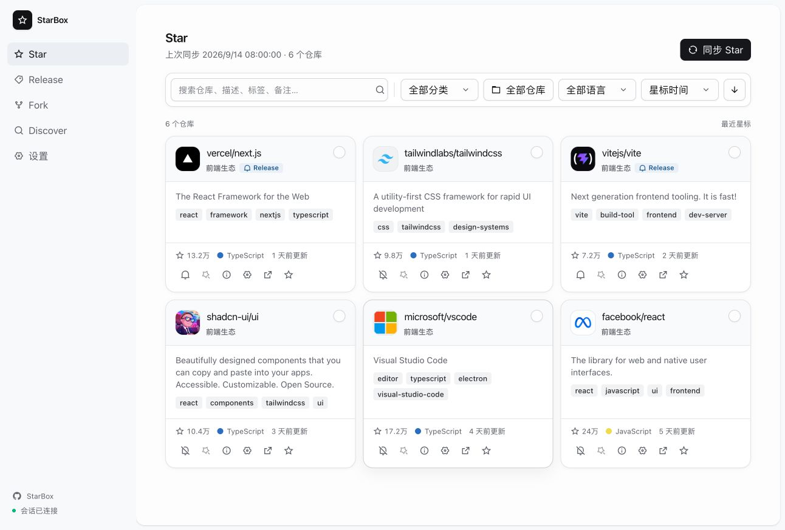

<div align="center">

# StarBox

**把收藏的仓库、关注的版本和维护的 Fork，放进自己的 GitHub 工作台。**

一个面向个人开发者、可自托管的 GitHub 管理工具。

[](https://github.com/iPotatow/StarBox/actions/workflows/ci.yml)

简体中文 · [繁體中文](README.zh-TW.md) · [English](README.en.md)

[核心功能](#核心功能) · [快速开始](#快速开始) · [部署配置](#部署配置)

</div>

<p align="center">
  
</p>

Star 过的项目越来越多，找回某个工具、跟进新版本、检查 Fork 是否落后，也逐渐成了日常工作。StarBox 把这些操作集中到一个界面：整理收藏、订阅发布、维护已有 Fork，再从发现页找到下一个值得关注的项目。

前端与 API 部署在 Cloudflare Workers，账号数据存储在 D1。换设备登录后，可以继续使用自己的分类、备注和订阅；AI 分析按需配置。

## 核心功能

| 想做的事 | StarBox 提供的能力 |
| --- | --- |
| **找回并整理收藏** | 搜索已 Star 的仓库，按分类、语言和时间筛选；查看 README、记录备注，使用 AI 摘要、标签、分类与批量分析。 |
| **跟进版本发布** | 聚合订阅仓库的最新 Release，搜索仓库、切换历史版本，并按目标设备推荐安装包；支持最新 Release 的 AI 总结。 |
| **维护已有 Fork** | 查看与上游的领先 / 落后状态和最近一次 Actions 运行，同步上游或手动触发 Workflow。 |
| **发现新项目** | 通过 GitHub 搜索热门、活跃或新近仓库，按语言、Topic 和时间范围筛选，并直接 Star。 |

Settings 中可管理 GitHub 连接、AI 服务与模型、MCP 连接、分类、外观、导航、Release 规则，以及数据导入 / 导出。当前范围不包含 Gist 管理和创建 Fork。

支持简体中文、繁體中文与 English，可在设置页或桌面侧边栏切换，语言偏好会在登录设备间同步。

## 快速开始

### 部署自己的工作台

需要 Node.js、npm 和可使用 Workers / D1 的 Cloudflare 账号。

```bash
git clone https://github.com/iPotatow/StarBox.git
cd StarBox
npm ci
npx wrangler login
npm run deploy
```

部署脚本会先运行项目检查，查找或创建名为 `starbox` 的 D1 数据库，初始化或升级受支持的数据库结构，再部署 Worker 与静态资源，无需手动填写数据库 UUID。

**首次部署还需完成以下配置：**

1. 为 Worker 绑定自定义域名或 route；默认关闭 `workers.dev`。
2. 设置非空的 `LOGIN_PASSWORD` 和 `STARBOX_ENCRYPTION_KEY`，按需修改默认用户名 `admin`。
3. 打开部署地址并登录，在 Settings 中连接 GitHub Token；需要 AI 分析时再添加 AI 服务与模型。

### 部署配置

通过交互式命令设置 Worker 密钥：

```bash
npx wrangler secret put LOGIN_PASSWORD
npx wrangler secret put STARBOX_ENCRYPTION_KEY
npx wrangler secret put LOGIN_USERNAME
```

| 变量 | 用途与默认值 |
| --- | --- |
| `LOGIN_USERNAME` | 登录用户名，默认 `admin`，可改为自定义值。 |
| `LOGIN_PASSWORD` | 必须为非空值；缺失时拒绝登录，没有默认密码。 |
| `STARBOX_ENCRYPTION_KEY` | 必须为非空值；trim 后经 SHA-256 派生，用于 AES-256-GCM 凭据加密。 |
| `SESSION_TTL_SECONDS` | 会话有效期，默认 `604800` 秒（7 天）。 |

不要将密钥写入仓库或 `wrangler.jsonc`。如果 Cloudflare 登录账号下有多个账号，请设置 `CLOUDFLARE_ACCOUNT_ID` 选择部署目标。

配置公开访问地址后，运行远端健康检查：

```bash
STARBOX_DEPLOYMENT_URL=https://your-domain.example npm run deploy:verify
```

该命令检查 `/api/health` 的数据库、登录配置和加密配置。未设置 `STARBOX_DEPLOYMENT_URL` 时会跳过远端检查；本地检查通过不能代替生产验证。

### 数据库初始化与升级

部署脚本先运行 `npm run check:installed`，再根据远端数据库结构选择操作：

- 空库：执行 `migrations/0001_schema.sql`，建立最终结构。
- 受支持的旧结构：使用 `migrations/0002_legacy_upgrade.sql` 升级，包括旧多表结构和已合并的旧单用户结构。
- 当前结构：不执行 SQL；未知或中间结构会中止部署。

仓库只维护这两个 SQL 文件，它们不是依次执行的增量迁移链。脚本校验最终 8 表结构、关联、JSON、数据计数和关键查询计划，并通过临时 Wrangler 配置部署，不改写仓库内的 `wrangler.jsonc`。升级已有实例前，先备份 D1 数据并保留原有加密密钥。

### 本地预览与开发

```bash
npm ci
npm run dev
```

默认预览地址为 `http://127.0.0.1:4173`。此命令构建并启动静态 UI 预览，`/api/*` 返回 501；完整 API 联调需要 Wrangler、本地 D1 结构和本地凭据配置。

提交代码前可运行：

```bash
npm run check
```

该检查使用已安装依赖的真实类型，执行自动化测试、生产构建与 UI 结构检查，无需浏览器运行环境。CI 在 main 推送、面向 main 的 Pull Request 和手动触发时运行相同检查；界面交互与真实服务联调需另行验证。完整要求见 [验证契约](VERIFICATION.md)。

## 连接 AI 助手

在 **Settings → MCP** 创建独立连接凭据，将 `/mcp` 地址与 Bearer 请求头填入支持 Streamable HTTP 的客户端。AI 可搜索收藏、读取备注与 README、查询分类、订阅及版本；默认只读，可按连接开启备注、分类和标签修改。凭据支持有效期、最近使用时间和撤销，修改沿用版本冲突校验。

详见 [MCP 使用说明](MCP.md)。当前采用自定义 Bearer 请求头，不支持仅 OAuth 的客户端。

## 数据由自己管理

- **跨设备延续工作台**：D1 保存账号业务数据，IndexedDB 用于浏览器缓存与本地加速。
- **凭据加密存储**：GitHub Token、AI Key 和敏感自定义请求头由 Worker 加密后写入 D1，凭据 API 不返回明文。
- **AI 按需连接**：在 Settings 中配置服务与模型，让仓库整理和版本阅读使用自己的 AI 配置。

README 与 Release 内容支持 Markdown 和 GFM，原始 HTML 不执行。

## 同步与架构

D1 保持 8 张产品表。Repository 用户字段通过 `user_revision` 做乐观并发；Release 原文和附件由浏览器缓存持有，最新 Release 的 AI 总结存储于 D1。Star 同步最多读取 3,000 个仓库，D1 业务写入按最多 50 条语句一批处理。

常规写入在服务端确认后不会立即触发全量 Bootstrap；Bootstrap 仍是账号数据的权威校准入口，等待进行中的写入，遇到重叠会重新获取快照。IndexedDB 只持久化变化的 entity store，并合并快速连续写入。登录会话变化会取消旧请求，编辑器保留打开时的草稿与版本。

五个业务页面按需加载；Star 卡片使用 `content-visibility` 延迟离屏布局与绘制。入口、CSS 和页面分块使用内容哈希与 immutable 静态缓存，页面加载失败提供重载恢复。

Worker 入口、路由与业务处理分离，`worker/routes` 按业务域组织，`worker/repositories` 构建写入 SQL，`worker/repository.ts` 执行 D1 事务；`shared` 统一前后端数据契约、设置校验和附件平台规则。

登录使用安全 Cookie 与频率限制，写请求校验同源 Origin 和 JSON Content-Type。GitHub 请求限制为 30 秒 / 8 MiB，AI 请求限制为 60 秒 / 2 MiB，AI 请求禁止重定向。Workers Logs 已启用，采样率为 10%。

## 技术与文档

React 19 · TypeScript · Tailwind CSS 4 · Cloudflare Workers · D1

界面组件采用 [COSS](https://github.com/cosscom/coss) 的 copy/paste-and-own 模式，交互基于 [Base UI](https://github.com/mui/base-ui)，图标使用 [Phosphor Icons](https://phosphoricons.com/)。

- [验证契约](VERIFICATION.md)：自动化检查、CI 与生产验证边界。
- [第三方声明](THIRD_PARTY_NOTICES.md)：依赖来源与许可证说明。

遇到问题或有功能建议，欢迎提交 [Issue](https://github.com/iPotatow/StarBox/issues)，并附上复现步骤和相关环境信息。

## 关于与诊断

设置底部的“关于”区域显示应用版本，有新部署时提示刷新，并支持复制版本、服务与浏览器诊断信息用于问题反馈。诊断内容不包含密码或连接凭据。
